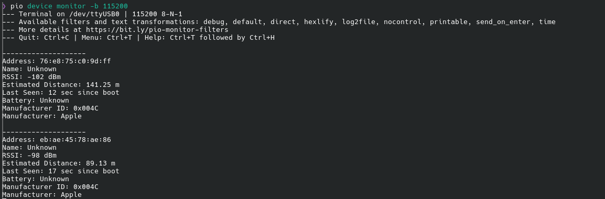

# esp32-ble-scanner
Simple BLE scanner using an ESP32 that you monitor over serial. <br>


## Using the Scanner
### Flash Target ESP32
Plug in your ESP32 to your laptop.
<br>Run the following commands in terminal:
#### Upload software
```
pio run --target upload
```

#### View data
```
pio device monitor -b 115200
```

## Resources
### Bluetooth Manufacturer List CSV Source
```
https://gist.github.com/angorb/f92f76108b98bb0d81c74f60671e9c67#file-bluetooth-company-identifiers-csv 
```